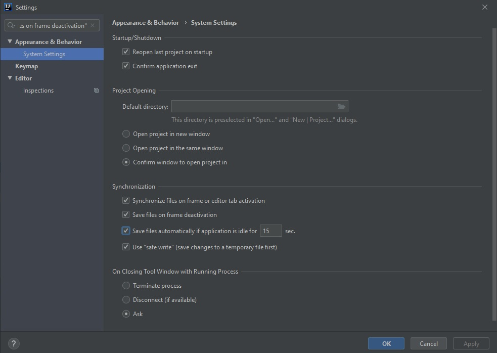

## My HOMEWORK description
* Let's take class JsonApplicationContext.
* For making my code more readble i should create method createBeans() and put it on our constructor.
* I think we should check json changes before getBean.
* If jsonType equals not equals givingType change it.
* create psvm method with while(true) and Thread.sleep(1000)
* When I did it, i'd thought it's over!But idea(I didn't know it before) not update on runtime my file. 
* Moreover, I found that when I press the altab, everything works.I was desperate...
* For complete this task I google something like WatchService API and the Apache Commons IO Monitor Library.
But this one wasn't answer for my question. So spend mb 3 hours testing different things.
And answer was that:

